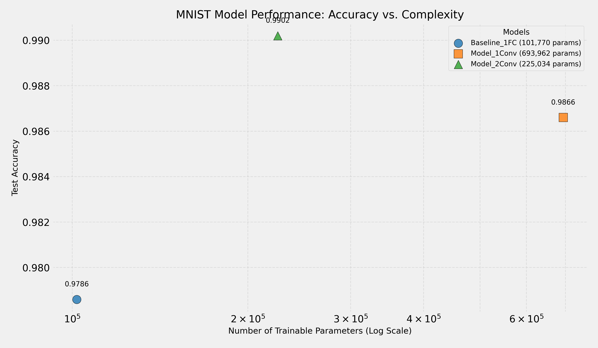

# MNIST CNN Layer Analysis: Accuracy vs. Parameters

This Jupyter Notebook explores the effect of adding convolutional layers on the performance and complexity of a neural network for classifying handwritten digits from the MNIST dataset. This project was completed as part of an assignment (Question 6) for a Digital Image Processing course.

## Overview

The goal is to understand how model architecture, specifically the addition of Convolutional Neural Network (CNN) layers (Conv2D and MaxPooling2D), impacts:
1.  **Test Accuracy:** How well the model classifies unseen digits.
2.  **Model Complexity:** Measured by the total number of trainable parameters.

The analysis starts with a simple baseline model using only fully connected (Dense) layers and progressively adds convolutional and pooling layers, observing the changes in performance and parameter count.

## Methodology

1.  **Data Loading & Preprocessing:**
    * The standard MNIST dataset (60k training, 10k testing images of 28x28 pixels) is loaded using `tensorflow.keras.datasets.mnist`.
    * Images are reshaped to include a channel dimension `(28, 28, 1)`.
    * Pixel values are normalized to the range [0, 1].
    * Labels are one-hot encoded.

2.  **Models Built:**
    * **Baseline_1FC:** A simple model with one hidden Dense layer (128 neurons) after flattening the input image.
    * **Model_1Conv:** Introduces a Conv2D layer (32 filters, 3x3 kernel) and a MaxPooling2D layer (2x2) before flattening and passing to the Dense layers.
    * **Model_2Conv:** Adds a second Conv2D layer (64 filters, 3x3 kernel) and MaxPooling2D layer before flattening and the Dense layers.

3.  **Training & Evaluation:**
    * Each model is compiled using the Adam optimizer and categorical cross-entropy loss.
    * Models are trained for 5 epochs with a batch size of 32.
    * Test accuracy and the total number of trainable parameters (`model.count_params()`) are recorded for each model.

4.  **Visualization:**
    * A scatter plot is generated showing Test Accuracy vs. Number of Parameters (using a log scale for parameters) to visualize the relationship between complexity and performance.

## Results

The following table summarizes the test accuracy and the number of trainable parameters for each model after training for 5 epochs:

| Model Name     | Test Accuracy | Trainable Parameters |
| -------------- | -------------:| -------------------:|
| Baseline_1FC   | 0.9780        | 101,770             |
| Model_1Conv    | 0.9853        | 693,962             |
| Model_2Conv    | 0.9893        | 225,034             |

*(Note: Accuracy values are based on a sample run and may vary slightly. Parameter counts are exact.)*

The relationship between the number of parameters (complexity) and test accuracy is visualized below:

**Observations:**
* Adding the first Conv/Pool block (`Model_1Conv`) significantly increased accuracy compared to the `Baseline_1FC`, despite having the highest parameter count due to the large dense layer connection size.
* Adding the second Conv/Pool block (`Model_2Conv`) further improved accuracy while *reducing* the parameter count compared to `Model_1Conv`. This highlights how deeper pooling can lead to more parameter-efficient architectures by reducing the feature map size before the dense layers.

## Analysis & Conclusion
*(Keep your existing analysis here, or refine it based on the concrete results shown above)*
* **Initial Accuracy Increase:** ...
* **Potential Accuracy Decrease (Overfitting):** ...
* **Parameter Efficiency:** ...

## How to Run

1.  Ensure you have the required dependencies installed (see below).
2.  Open the `.ipynb` file in Jupyter Notebook, JupyterLab, Google Colab, or a compatible environment (like VS Code with Python/Jupyter extensions).
3.  Run the cells sequentially from top to bottom.

## Dependencies

* TensorFlow / Keras (`tensorflow`)
* NumPy (`numpy`)
* Matplotlib (`matplotlib`)